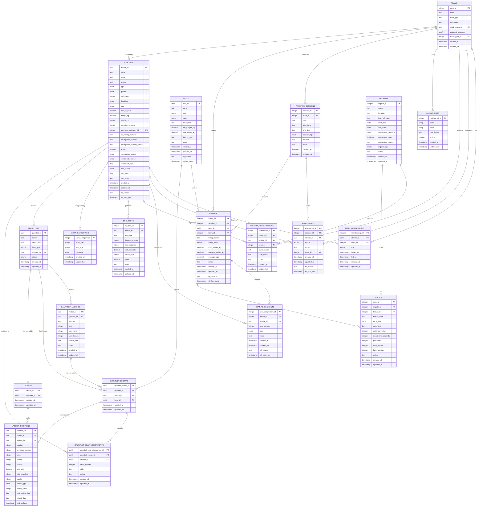

# Database Schema Relationships

## Overview
This document outlines the complete relationship structure of the **CrewHub database**, including both the core boathouse management tables and the integrated Rowcalibur competitive system tables. The database is shared between CrewHub (API server) and boathouse-etl (ETL service) via the microservices architecture.

## Core Entity Types

### Primary Key Strategies
- **UUID Primary Keys**: `athletes`, `boats`, `gauntlets`, `gauntlet_matches`, `ladders`, `ladder_positions`
- **Auto-increment Integer Primary Keys**: `teams`, `practice_sessions`, `lineups`, `seat_assignments`, `attendance`, `usra_categories`, `mailing_lists`, `regattas`, `regatta_registrations`, `races`, `erg_tests`, `etl_jobs`, `team_memberships`

## Complete Database Relationship Diagram



## Core Boathouse Management System

### 1. Athlete Management
```
athletes (UUID) ←→ team_memberships ←→ teams (INTEGER)
athletes (UUID) ←→ usra_categories (INTEGER)
athletes (UUID) ←→ attendance (INTEGER)
athletes (UUID) ←→ seat_assignments (INTEGER)
athletes (UUID) ←→ regatta_registrations (INTEGER)
athletes (UUID) ←→ erg_tests (INTEGER)
athletes (UUID) ←→ teams (head_coach_id)
```

**Key Relationships:**
- **Many-to-Many**: Athletes ↔ Teams (through TeamMembership)
- **One-to-Many**: Athletes → Attendance records
- **One-to-Many**: Athletes → SeatAssignments
- **One-to-Many**: Athletes → RegattaRegistrations
- **One-to-Many**: Athletes → ErgTests
- **One-to-Many**: Athletes → Teams (as head coach)

### 2. Team Management
```
teams (INTEGER) ←→ team_memberships ←→ athletes (UUID)
teams (INTEGER) ←→ practice_sessions (INTEGER)
teams (INTEGER) ←→ lineups (INTEGER)
teams (INTEGER) ←→ attendance (INTEGER)
teams (INTEGER) ←→ regatta_registrations (INTEGER)
teams (INTEGER) ←→ mailing_lists (INTEGER)
teams (INTEGER) ←→ athletes (head_coach_id)
```

**Key Relationships:**
- **Many-to-Many**: Teams ↔ Athletes (through TeamMembership)
- **One-to-Many**: Teams → PracticeSessions
- **One-to-Many**: Teams → Lineups
- **One-to-Many**: Teams → Attendance records
- **One-to-Many**: Teams → RegattaRegistrations
- **Many-to-One**: Teams → MailingList

### 3. Practice & Session Management
```
practice_sessions (INTEGER) ←→ teams (INTEGER)
practice_sessions (INTEGER) ←→ attendance (INTEGER)
practice_sessions (INTEGER) ←→ lineups (INTEGER)
```

**Key Relationships:**
- **Many-to-One**: PracticeSessions → Teams
- **One-to-Many**: PracticeSessions → Attendance records
- **One-to-Many**: PracticeSessions → Lineups

### 4. Boat & Lineup Management
```
boats (UUID) ←→ lineups (INTEGER)
lineups (INTEGER) ←→ practice_sessions (INTEGER)
lineups (INTEGER) ←→ teams (INTEGER)
lineups (INTEGER) ←→ seat_assignments (INTEGER)
lineups (INTEGER) ←→ races (INTEGER)
lineups (INTEGER) ←→ gauntlet_matches (UUID) [OPTIONAL]
```

**Key Relationships:**
- **One-to-Many**: Boats → Lineups
- **Many-to-One**: Lineups → PracticeSessions
- **Many-to-One**: Lineups → Teams
- **One-to-Many**: Lineups → SeatAssignments
- **One-to-Many**: Lineups → Races
- **One-to-Many**: Lineups → GauntletMatches (optional)

### 5. Competition Management
```
regattas (INTEGER) ←→ regatta_registrations (INTEGER)
regattas (INTEGER) ←→ races (INTEGER)
regatta_registrations (INTEGER) ←→ athletes (UUID)
regatta_registrations (INTEGER) ←→ teams (INTEGER)
races (INTEGER) ←→ lineups (INTEGER)
```

**Key Relationships:**
- **One-to-Many**: Regattas → RegattaRegistrations
- **One-to-Many**: Regattas → Races
- **Many-to-One**: RegattaRegistrations → Athletes
- **Many-to-One**: RegattaRegistrations → Teams
- **Many-to-One**: Races → Lineups

## Rowcalibur Competitive System Integration (Simplified Design)

### Design Philosophy
The Rowcalibur competitive system has been simplified to provide a clean, single-point-of-control architecture:

- **Single Point of Control**: Gauntlet is the primary entity - creation and deletion manages all related data
- **Minimal Configuration**: Removed complex configuration objects in favor of simple relational structure  
- **CASCADE Deletes**: When a gauntlet is deleted, all related data is automatically removed
- **1:1 Relationship**: Each gauntlet has exactly one ladder (auto-created)
- **No Redundancy**: Eliminated duplicate fields between gauntlets and ladders

### CASCADE Delete Chain
```
DELETE gauntlet → CASCADE deletes:
├── gauntlet_lineups
│   └── gauntlet_seat_assignments
├── gauntlet_matches
└── ladders
    └── ladder_positions
```

### 6. Gauntlet System
```
athletes (UUID) ←→ gauntlets (UUID) [created_by]
gauntlets (UUID) ←→ gauntlet_matches (UUID) [CASCADE]
gauntlets (UUID) ←→ gauntlet_lineups (UUID) [CASCADE]
gauntlet_matches (UUID) ←→ gauntlet_lineups (UUID) [2 per match, SET NULL]
gauntlet_lineups (UUID) ←→ gauntlet_seat_assignments (UUID) [CASCADE]
boats (UUID) ←→ gauntlet_lineups (UUID)
athletes (UUID) ←→ gauntlet_seat_assignments (UUID) [CASCADE]
```

**Key Relationships:**
- **One-to-Many**: Athletes → Gauntlets (as creator)
- **One-to-Many**: Gauntlets → GauntletMatches
- **One-to-Many**: GauntletMatches → GauntletLineups (exactly 2 per match: user & challenger)
- **One-to-Many**: GauntletLineups → GauntletSeatAssignments
- **One-to-Many**: Boats → GauntletLineups
- **Many-to-One**: GauntletLineups → Teams (optional team context)
- **One-to-Many**: Athletes → GauntletSeatAssignments

### 7. Ladder System
```
gauntlets (UUID) ←→ ladders (UUID) [1:1, CASCADE]
ladders (UUID) ←→ ladder_positions (UUID) [CASCADE]
gauntlet_lineups (UUID) ←→ ladder_positions (UUID) [CASCADE]
```

**Key Relationships:**
- **One-to-One**: Gauntlets → Ladders (auto-created, CASCADE)
- **One-to-Many**: Ladders → LadderPositions
- **One-to-Many**: GauntletLineups → LadderPositions

## Cross-System Integration Points

### 8. Athlete-Centric Integration
The `athletes` table serves as the central hub connecting both systems:
- **Boathouse System**: Team memberships, attendance, seat assignments, regatta registrations, erg tests
- **Rowcalibur System**: Gauntlet creation, ladder participation, competitive match tracking

### 9. Gauntlet Lineup System
The new `gauntlet_lineups` and `gauntlet_seat_assignments` tables provide proper two-side match structure:
- **Two-Side Matches**: Each gauntlet match has exactly two lineups (user & challenger)
- **Independent Structure**: Gauntlet lineups are separate from practice session lineups
- **Proper Seat Assignments**: Each lineup has detailed seat assignments with athlete positions
- **Boat Integration**: Each lineup references a specific boat
- **Team Context**: Optional team context for organizational purposes

### 10. Team Context
Teams provide organizational context for both systems:
- **Boathouse System**: Practice sessions, lineups, attendance tracking
- **Rowcalibur System**: Gauntlets and ladders can be team-specific through athlete team memberships

## Data Flow Patterns

### 11. Practice Session Workflow
```
Team → PracticeSession → Attendance (per Athlete)
Team → PracticeSession → Lineup → SeatAssignment (per Athlete)
```

### 12. Competition Workflow
```
Regatta → Race → Lineup (optional)
Athlete → RegattaRegistration → Regatta
```

### 13. Rowcalibur Competitive Workflow (Simplified)
```
Athlete → Gauntlet → Ladder (auto-created)
Athlete → Gauntlet → GauntletMatch → GauntletLineup (2 per match) → GauntletSeatAssignment
GauntletLineup → Ladder → LadderPosition
```

## Key Design Decisions

### 14. UUID vs Integer Primary Keys
- **UUID Tables**: Athletes, Boats, and all Rowcalibur tables (offline-first compatibility)
- **Integer Tables**: Core boathouse management tables (ETL from Google Sheets)

### 15. Two-Side Match Structure
- **GauntletMatch → GauntletLineup**: Each match has exactly 2 lineups (user & challenger sides)
- **GauntletLineup → GauntletSeatAssignment**: Each lineup has detailed seat assignments
- **LadderPosition**: Tracks position history via `previous_position` and `position` fields

### 16. Cross-Reference Strategy
- **Athlete-Centric**: All competitive activities tie back to athletes
- **Team-Context**: Team memberships provide organizational structure
- **Independent Gauntlet System**: Gauntlet lineups are separate from practice session lineups

## Query Patterns

### 17. Common Joins
```sql
-- Athlete with team memberships and competitive activities
SELECT a.*, tm.role, g.name as gauntlet_name, lp.position
FROM athletes a
LEFT JOIN team_memberships tm ON a.athlete_id = tm.athlete_id
LEFT JOIN gauntlets g ON a.athlete_id = g.created_by
LEFT JOIN ladder_positions lp ON a.athlete_id = (SELECT gl.gauntlet_lineup_id FROM gauntlet_lineups gl WHERE gl.gauntlet_lineup_id = lp.gauntlet_lineup_id);

-- Gauntlet match with both lineups and seat assignments
SELECT 
    gm.match_id,
    gm.workout,
    gl.side,
    gl.lineup_name,
    a.name as athlete_name,
    gsa.seat_number,
    gsa.side as seat_side
FROM gauntlet_matches gm
JOIN gauntlet_lineups gl ON gm.match_id = gl.match_id
JOIN gauntlet_seat_assignments gsa ON gl.gauntlet_lineup_id = gsa.gauntlet_lineup_id
JOIN athletes a ON gsa.athlete_id = a.athlete_id
WHERE gm.match_id = 'match-uuid'
ORDER BY gl.side, gsa.seat_number;
```

### 18. Performance Considerations
- **Indexes**: All foreign key relationships are indexed
- **Unique Constraints**: Prevent duplicate memberships and attendance records
- **Cascade Deletes**: Maintain referential integrity on team/session deletions

This relationship structure provides a flexible foundation for both traditional boathouse management and competitive rowing systems while maintaining data integrity and supporting offline-first operations.
