# CrewHub System Architecture

*Last Updated: December 2025*

## Overview

CrewHub serves as the **central API server and authentication hub** for the rowing club ecosystem. It acts as the primary data access point between external data sources (Google Sheets via boathouse-etl) and user-facing applications (Rowcalibur, Crewssignment), providing a unified PostgreSQL database with comprehensive API services and secure authentication.

## System Role & Position

CrewHub functions as the **API backbone** of the rowing club's digital infrastructure:

- **API Gateway**: Serves as the primary data access point for external applications
- **Authentication Service**: Provides secure PIN-based authentication for athletes across all applications
- **Data Management Layer**: Manages athlete profiles, teams, boats, and competitive systems
- **Shared Resource Provider**: Supplies models, config, auth, and services to boathouse-etl via shared module proxy

## Architecture Components

### 1. API Server System

#### Core Services
- **Authentication Service**: PIN-based login, token verification, password changes
- **Athlete Service**: Profile management, competitive status, USRA categories
- **Team Service**: Team management, membership tracking
- **Boat Service**: Boat inventory and specifications
- **Lineup Service**: Practice lineup management

#### API Endpoints
```
POST /auth/login          - Athlete authentication
POST /auth/verify         - Token verification
GET  /auth/athletes       - Public athlete list
POST /auth/change-pin     - Password change

GET  /api/athletes        - Athlete data (protected)
GET  /api/athletes/:id    - Individual athlete (protected)
PUT  /api/athletes/:id    - Update athlete (protected)

GET  /api/boats           - Boat inventory
GET  /api/boats/:id       - Individual boat details

GET  /api/lineups         - Practice lineups
POST /api/lineups         - Create lineup
PUT  /api/lineups/:id     - Update lineup
```

### 2. Database Schema

#### Core Entities
- **Athletes**: Complete athlete profiles with authentication, competitive status, and personal information
- **Teams**: Team definitions and compositions
- **Boats**: Boat inventory with standardized type notation (1x, 2x, 2-, 4x, 4+, 8+)
- **Practice Sessions**: Session scheduling and management
- **Attendance**: Practice attendance tracking
- **Lineups**: Detailed lineup management with seat assignments
- **USRA Categories**: Age and weight category classifications

#### Competitive Systems (Rowcalibur Integration)
- **Gauntlet System**: Individual athlete challenges and rankings
- **Ladder System**: Position-based competitive rankings
- **Match Records**: Detailed match history and statistics
- **Seat Assignments**: Competitive lineup management

### 3. Shared Resource Architecture

#### Microservices Integration
CrewHub provides shared resources to boathouse-etl via a dynamic module proxy system:

- **Models**: Database models and Sequelize definitions
- **Configuration**: Environment variables and database configuration
- **Authentication**: Auth services and middleware
- **Services**: Business logic services (athleteService, lineupService, etc.)

#### Shared Module Proxy
```typescript
// boathouse-etl/src/shared/index.ts
export const getModels = () => require('../crewhub/src/models');
export const getConfig = () => require('../crewhub/src/config');
export const getAuth = () => require('../crewhub/src/auth');
export const getServices = () => require('../crewhub/src/services');
```

### 4. Authentication Service

#### Security Features
- **PIN-Based Authentication**: Secure 4-digit PIN system for athletes
- **JWT Tokens**: Stateless authentication with 7-day expiration
- **Rate Limiting**: Protection against brute force attacks
- **Account Lockout**: Automatic lockout after failed attempts
- **PIN Reset Capabilities**: Secure PIN change functionality

#### API Endpoints
```
POST /auth/login          - Athlete authentication
POST /auth/change-pin     - PIN modification
POST /auth/verify         - Token validation
GET  /auth/athletes       - Athlete data retrieval
GET  /auth/health         - Service health check
```

### 5. Data Flow Architecture

#### Microservices Data Flow
```
Google Sheets (Source Data)
    ↓
boathouse-etl (ETL Service)
    ↓ (shared resources)
CrewHub (API Server)
    ↓
PostgreSQL Database (Shared Storage)
    ↓
External Applications (Rowcalibur, Crewssignment)
```

#### Real-time Data Access
```
External Apps → CrewHub API → Database → Structured Response
```

#### ETL Data Flow
```
Google Sheets → boathouse-etl → (via shared resources) → CrewHub Database
```

## Integration Points

### With boathouse-etl (ETL Service)
- **Shared Resources**: Models, config, auth, and services via module proxy
- **Data Synchronization**: Automated ETL jobs update CrewHub database
- **Configuration Management**: Centralized config via `config.json`
- **Authentication**: Shared auth services for ETL operations

### With Rowcalibur (Frontend)
- **Athlete Data**: Complete athlete profiles and competitive status
- **Gauntlet System**: Individual challenge rankings and match history
- **Ladder System**: Position-based competitive rankings
- **Boat Management**: Boat inventory and lineup assignments
- **Authentication**: Secure PIN-based login system

### With Crewssignment (Future)
- **Team Management**: Team compositions and member assignments
- **Practice Sessions**: Session scheduling and attendance tracking
- **Lineup Management**: Detailed seat assignments and boat configurations
- **Athlete Profiles**: Complete athlete information for assignment decisions

### With Google Sheets (Data Source)
- **Automated Sync**: Scheduled ETL jobs via boathouse-etl
- **Data Validation**: Comprehensive data quality checks
- **Error Reporting**: Detailed error logs and status reporting
- **Incremental Updates**: Efficient data processing for large datasets

## Technology Stack

### CrewHub API Server
- **Runtime**: Node.js with TypeScript
- **Database**: PostgreSQL with Sequelize ORM
- **Authentication**: JWT with bcrypt password hashing
- **API Framework**: Express.js with CORS and rate limiting
- **Shared Resources**: Dynamic module exports for boathouse-etl

### boathouse-etl Service
- **Runtime**: Node.js with TypeScript
- **ETL Engine**: Custom pipeline with Google Sheets API integration
- **Shared Resources**: Dynamic imports from CrewHub via module proxy
- **Configuration**: JSON-based shared resource configuration

### External Integrations
- **Google Sheets API**: Data extraction and synchronization (via boathouse-etl)
- **PostgreSQL**: Primary data storage and management (shared database)
- **JWT**: Stateless authentication tokens
- **bcrypt**: Secure password hashing

### Development & Deployment
- **Migration System**: Sequelize migrations with rollback capabilities
- **Environment Management**: Comprehensive configuration system
- **Logging**: Winston-based logging with multiple levels
- **Error Handling**: Global error handling with detailed reporting
- **Microservices**: Independent deployment and scaling

## Data Security & Privacy

### Authentication Security
- **PIN Encryption**: bcrypt hashing with salt
- **Rate Limiting**: 100 requests per 15 minutes per IP
- **Account Lockout**: Automatic lockout after failed attempts
- **JWT Expiration**: Configurable token lifetime
- **CORS Protection**: Configurable origin restrictions

### Data Protection
- **Input Validation**: Comprehensive data validation and sanitization
- **SQL Injection Prevention**: Sequelize ORM with parameterized queries
- **Error Information**: Sanitized error messages in production
- **Audit Logging**: Complete authentication and data access logs

## Scalability & Performance

### ETL Performance
- **Batch Processing**: Configurable batch sizes (default: 50 records)
- **Retry Logic**: Configurable retry attempts with exponential backoff
- **Connection Pooling**: Efficient database connection management
- **Memory Management**: Proper cleanup and resource management

### API Performance
- **Rate Limiting**: Prevents system overload
- **Connection Pooling**: Efficient database connections
- **Response Caching**: JWT-based stateless authentication
- **Error Handling**: Graceful degradation and recovery

## Monitoring & Maintenance

### Health Monitoring
- **Health Check Endpoints**: Service status monitoring
- **ETL Status Tracking**: Complete job execution monitoring
- **Database Connection Monitoring**: Connection health verification
- **Authentication Metrics**: Login success/failure tracking

### Maintenance Operations
- **Database Migrations**: Version-controlled schema changes
- **ETL Job Management**: Manual and scheduled job execution
- **Data Validation**: Comprehensive data quality checks
- **Backup & Recovery**: Data integrity and recovery mechanisms

## Future Integration Considerations

### API Expansion
- **RESTful API**: Standardized endpoints for all data access
- **GraphQL Support**: Flexible query capabilities
- **Webhook Integration**: Real-time data synchronization
- **Bulk Operations**: Efficient batch data operations

### Enhanced Security
- **OAuth Integration**: Third-party authentication support
- **Role-Based Access**: Granular permission management
- **API Versioning**: Backward compatibility management
- **Audit Trails**: Comprehensive access logging

## System Architecture Diagram

```mermaid
graph TB
    %% External Data Sources
    GS[Google Sheets<br/>📊 Club Data]
    
    %% Boathouse-ETL Core
    subgraph BHE[Boathouse-ETL System]
        ETL[ETL Pipeline<br/>🔄 Extract, Transform, Load]
        AUTH[Authentication Service<br/>🔐 PIN-based Auth]
        API[API Gateway<br/>🌐 REST Endpoints]
        ORCH[ETL Orchestrator<br/>⚙️ Process Management]
    end
    
    %% Database
    DB[(PostgreSQL Database<br/>🗄️ Centralized Storage)]
    
    %% User Applications
    RC[Rowcalibur<br/>🏆 Competitive System]
    CA[Crewssignment<br/>👥 Team Management]
    
    %% Data Flow - ETL
    GS -->|Extract Data| ETL
    ETL -->|Transform & Validate| ORCH
    ORCH -->|Load Data| DB
    
    %% Data Flow - API Access
    RC -->|Authenticate| AUTH
    CA -->|Authenticate| AUTH
    AUTH -->|JWT Token| API
    API -->|Query Data| DB
    DB -->|Structured Response| API
    API -->|Data Response| RC
    API -->|Data Response| CA
    
    %% ETL Process Details
    subgraph ETL_DETAILS[ETL Process Flow]
        EXTRACT[Extract<br/>Google Sheets API]
        TRANSFORM[Transform<br/>Data Validation]
        LOAD[Load<br/>PostgreSQL]
        EXTRACT --> TRANSFORM --> LOAD
    end
    
    %% Database Schema
    subgraph DB_SCHEMA[Database Entities]
        ATHLETES[Athletes<br/>👤 Profiles & Auth]
        TEAMS[Teams<br/>👥 Compositions]
        BOATS[Boats<br/>🚣 Equipment]
        SESSIONS[Practice Sessions<br/>📅 Scheduling]
        ATTENDANCE[Attendance<br/>✅ Tracking]
        LINEUPS[Lineups<br/>🪑 Seat Assignments]
        GAUNTLET[Gauntlet System<br/>⚔️ Challenges]
        LADDER[Ladder System<br/>📈 Rankings]
    end
    
    DB --> DB_SCHEMA
    
    %% Styling
    classDef external fill:#e1f5fe,stroke:#01579b,stroke-width:2px
    classDef boathouse fill:#f3e5f5,stroke:#4a148c,stroke-width:2px
    classDef database fill:#e8f5e8,stroke:#1b5e20,stroke-width:2px
    classDef applications fill:#fff3e0,stroke:#e65100,stroke-width:2px
    classDef etl fill:#fce4ec,stroke:#880e4f,stroke-width:2px
    classDef schema fill:#f1f8e9,stroke:#33691e,stroke-width:2px
    
    class GS external
    class ETL,AUTH,API,ORCH boathouse
    class DB database
    class RC,CA applications
    class EXTRACT,TRANSFORM,LOAD etl
    class ATHLETES,TEAMS,BOATS,SESSIONS,ATTENDANCE,LINEUPS,GAUNTLET,LADDER schema
```



## Data Flow Summary

### 1. ETL Data Flow (Scheduled)
- **Google Sheets** → **ETL Pipeline** → **PostgreSQL Database**
- Automated data synchronization from club spreadsheets
- Comprehensive data validation and transformation
- Maintains data integrity and consistency

### 2. API Data Flow (Real-time)
- **User Applications** → **Authentication Service** → **API Gateway** → **Database**
- Secure PIN-based authentication for all requests
- JWT token-based stateless authentication
- Structured data responses for application consumption

### 3. Integration Points
- **Rowcalibur**: Competitive systems, athlete data, authentication
- **Crewssignment**: Team management, practice sessions, lineups
- **Google Sheets**: Source data extraction and synchronization

## Conclusion

Boathouse-ETL serves as the critical infrastructure component that enables the rowing club's digital transformation. By providing centralized data management, secure authentication, and reliable ETL capabilities, it creates a solid foundation for current and future applications while maintaining data consistency and security across the entire ecosystem.

The system's modular architecture and comprehensive error handling ensure reliability and maintainability, while its integration capabilities support seamless connectivity with external applications and data sources.
